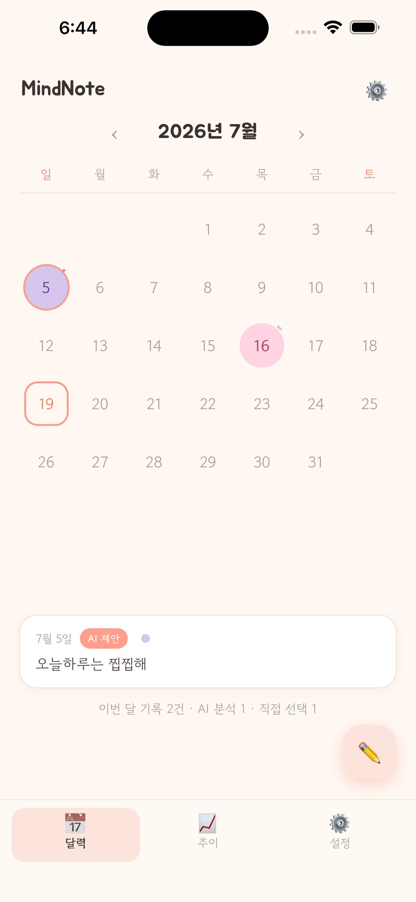
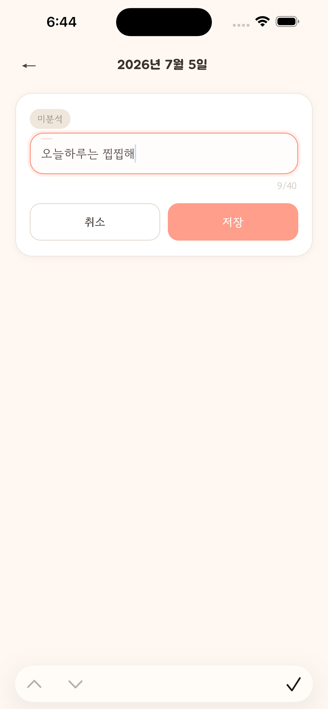
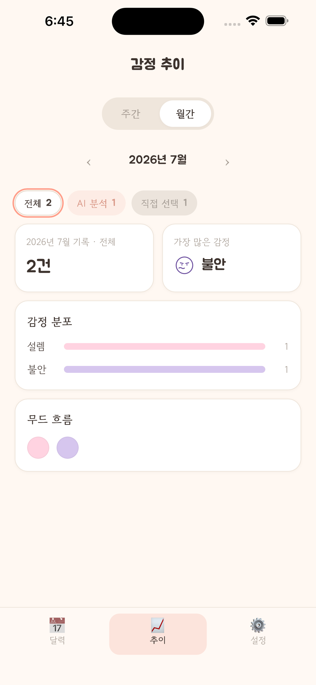
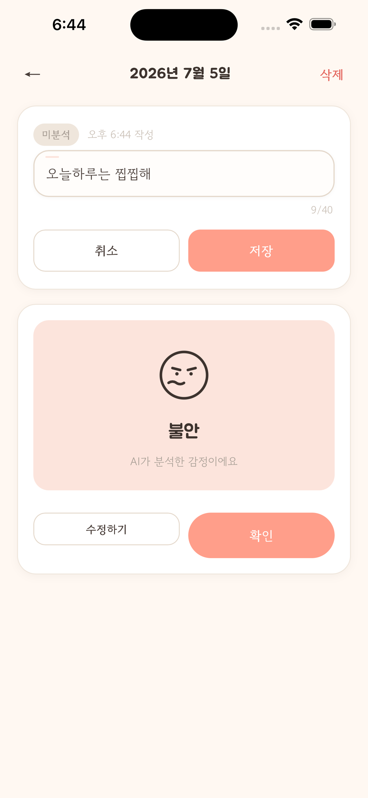
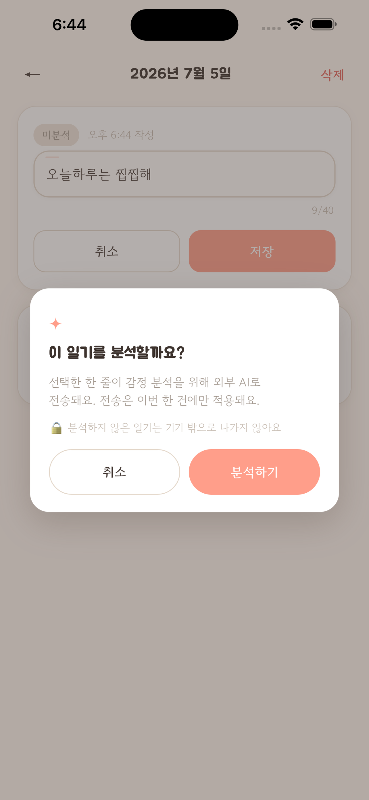
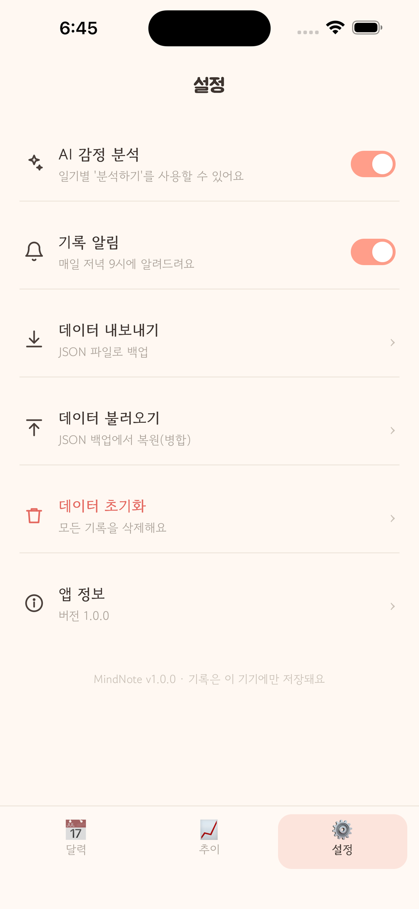

# MindNote

하루 한 줄로 마음을 기록하고, 원할 때만 AI가 감정을 분석해주는 iOS 감정 일기 앱입니다.

## 스크린샷

     

## 주요 기능

| 기능 | 설명 |
|---|---|
| 한 줄 일기 | 달력에서 날짜를 골라 하루 한 줄 기록. 저장은 AI와 완전히 분리되어 오프라인에서도 항상 성공 |
| AI 감정 분석 | 건별 옵트인. 분석하기를 누른 문장만 프록시를 거쳐 외부 LLM으로 전송하고 8종 감정 라벨 중 하나를 제안 |
| 감정 추이 | 주간/월간 감정 분포와 무드 흐름을 로컬 계산만으로 표시 |
| 기록 알림 | 매일 저녁 로컬 알림 |
| 데이터 백업 | JSON 내보내기/불러오기 |

## 프라이버시 설계

MindNote는 개인정보를 수집하지 않습니다. 계정과 로그인이 없고 모든 기록은 기기에만 저장됩니다. AI 감정 분석은 기본 비활성이며, 사용자가 건별로 옵트인한 문장 한 건만 일시 전송되고 저장되지 않습니다.

개인정보 처리방침: https://m32k.github.io/mindnote-support/privacy.html

지원 페이지: https://m32k.github.io/mindnote-support/

## 기술 스택

| 영역 | 사용 기술 |
|---|---|
| 프론트엔드 | Vanilla JS + Vite SPA |
| iOS 패키징 | Capacitor 8 (@capacitor/ios, Local Notifications) |
| AI 연동 | Node 프록시 서버 경유 외부 LLM 호출. 앱 토큰 + CORS 화이트리스트 + IP/일일 쿼터 가드 |
| 테스트 | Vitest 단위 테스트 + Playwright E2E |
| 개발 방식 | 스펙 우선: 인터뷰, Seed, PRD/기능명세/화면흐름도/ERD/QA 케이스 확정 후 구현 |

아키텍처: iOS 앱(Capacitor + SPA)은 옵트인 요청만 프록시 서버로 보내고, 프록시가 외부 LLM API를 호출합니다. 일기 저장은 항상 로컬에서 이뤄집니다.

## App Store 출시 준비 현황 (2026-07-19)

| 항목 | 상태 |
|---|---|
| 앱 레코드 | com.byungguk.mindnote 생성 완료 |
| 빌드 | 빌드 12 (v1.0) 업로드 및 연결 완료 |
| 가격/지역 | 무료, 175개 국가 및 지역 |
| 개인정보 | 라벨 게시, 처리방침/지원 페이지 연결 (GitHub Pages) |
| 연령 등급 | 4+ |
| 스크린샷 | 6.9인치 10장 등록 |
| 상태 | 심사 제출 대기 |

## 문의

sncom1941@gmail.com
